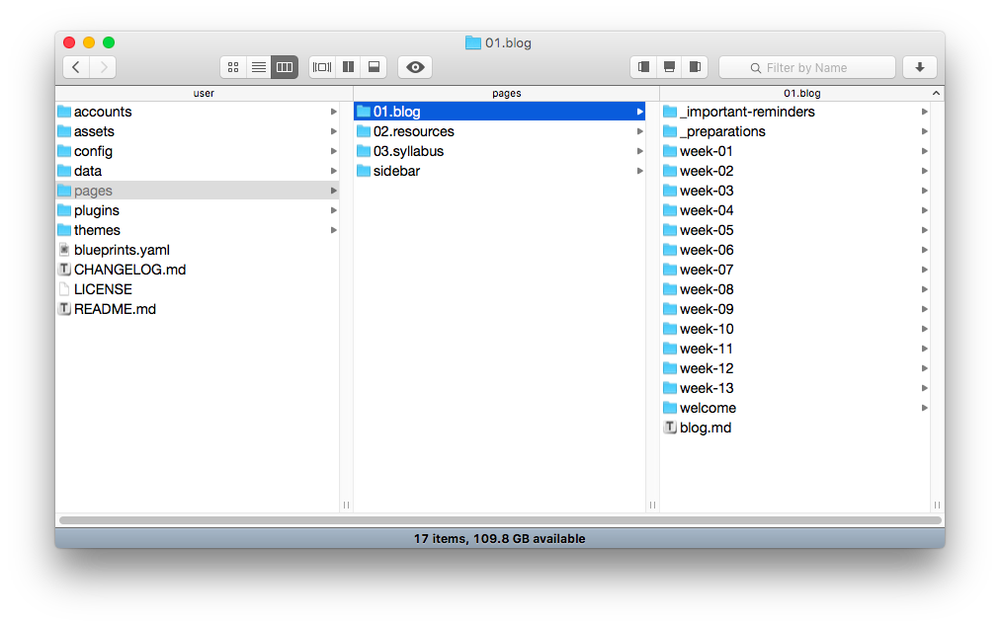

# Course Companion Skeleton


The **Course Companion** skeleton is intended to support a 13-week face-to-face or blended-format course. It also supports a [flipped-LMS approach](http://hibbittsdesign.org/blog/posts/flipped-lms-using-an-open-and-collaborative-platform) using Grav as an open and collaborative Web platform.

**Why Flip your LMS with Grav?**  
- To support pedagogical goals unmet by current LMS/platform
- To increase capability of access, sharing and collaboration
- To deliver a better student (and facilitator) experience

# Features

* A complete ready-to-run Grav Skeleton Package (open source)
* Blog-format, with important reminders & preparations areas
* Additional site pages can be easily added
* Sidebar is a simple markdown file, which can also contain HTML
* URL flag to only display page content (for display within LMS). For example, http://somewhere.com/cpt-363/blog/week-01/onlydisplaypagecontent:true
* External links are automatically opened in a new Tab/Window
* Built-in support for entire site to be maintained on GitHub
* Since everything is built with Grav it can be entirely customized.

To learn more about how to most effectively use the Grav Course Companion, visit [hibbittdesign.org](http://hibbittsdesign.org/blog/)

#Site Structure



## Quick Setup for a New Grav Course Companion Site

1. Download the most current release at [getgrav.org/downloads/skeletons](https://getgrav.org/downloads/skeletons)
2. Unzip the package into your web root folder (running PHP 5.5.9 or higher).
3. Point your browser at the folder.
4. Create your site administrator account.
5. And you are done!

To fully enjoy the benefits of the workflow that Grav can support, please read the step-by-step guide [Running Grav Locally with MAMP](http://hibbittsdesign.org/blog/posts/running-grav-locally-with-mamp) and [Using Grav with GitHub Desktop (and Deploy)](http://hibbittsdesign.org/blog/posts/using-grav-with-github-and-deploy).

**TIP:** Check out the general [Grav Installation Instructions](http://learn.getgrav.org/basics/installation) for more details on this process.

# Configuration

The 'site.yaml' file located in the '/user/config/' folder contains the following default values:
```
title: CPT-363
metadata:
    description: 'A short description of your course would go here'
displaymenuentries:
    enabled: false        # display of additional menu entries
menu:                     # menu entry for adding external sites/tools
    - text: Grav
      icon: arrow-circle-right
      url: http://getgrav.org/
icon:                     # default font awesome icons for preparation and post entries
    preparations: check-circle
    posts: calendar-o
github:
    location: none         # menu | page | none
    tree: https://github.com/hibbitts-design/grav-skeleton-course-companion-bones-vanilla/edit/master/
rssbutton:
    display: true
```

| Setting | Child Setting | Description                                                                                                            |
|---------|---------------|------------------------------------------------------------------------------------------------------------------------|
| title   |               | The course number/id, to be displayed at the top of every page.                                                      |
| metadata  |  description | The short description of the course companion site                                       |
| displaymenuentries  |  enabled | Can be set to `true` or `false`. When set to `true`, all defined menu items are added to the navbar.                                       
|
| menu  |  text | Text label for external links to be included on navbar                                       |
| menu  |  icon | Font awesome icon code for external link (optional)                                        |
| menu  |  url | URL for external link
|                                       |
| icon  | preparations    | Change the default font awesome icon for the preparation area on the home page.
|
| icon  | posts          | Change the default font awesome icon for the weekly blog posts (i.e. weekly summaries).            |
| rssbutton  | display       | Can be set to `true` or `false`. When set to `true`, it displays RSS buttons on the sidebar for each page. |
| github  | enabled       | Can be set to `true` or `false`. When set to `true`, it generates the **Edit this page** link to GitHub for each page. |
| github  | tree          | Sets the tree by which your site's content is based. Generally the repo your site's content is pulled from.            |

## Frequently asked questions

_How do you create a new page?_  
The recommended method is to copy an existing page (such as'Resources') using either the Admin Panel or if working directly with files copy the page folder 'resources' and then add the numeric prefix (e.g. '04.'). Once an existing page has been copied then modify as needed.

---
